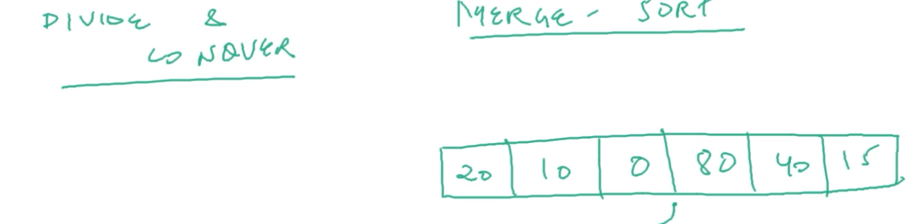
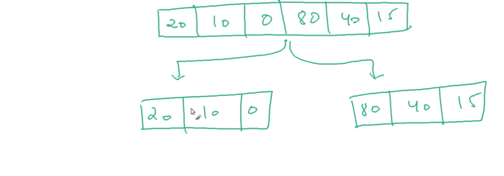
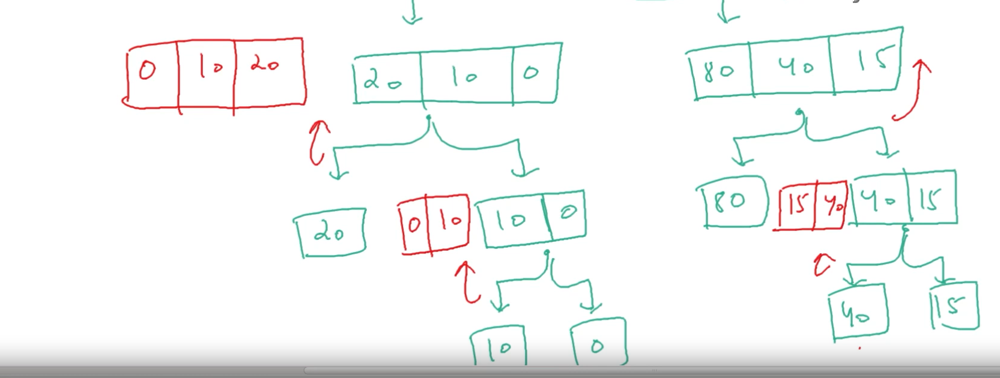

# Sorting

## DSA -Sorting in Java Script1

| No.| Questions                                                                                                                                                               |
| ---| ----------------------------------------------------------------------------------------------------------------------------------------------------------------------------------------------------------------------------------------------------------------------|
|    | **Sorting-concepts**                                                                                                                                                    |      
| 1  | [Module-Introduction](#)                                                                                                                                                |
| 2  | [Selection-sort-implementation-java-script](#)                                                                                                                          |
| 3  | [Merge two sorted arrays-theory](#)                                                                                                                                     |
| 4  | [Merge-sort-theory](#)                                                                                                                                                  |
| 5  | [Merge-sort-implementation](#)                                                                                                                                          |
| 6  | [Merge-sort-complexity-analysis ](#)                                                                                                                                    |
| 7  | [Two-way-partitioning-Algorithm](#)                                                                                                                                     |
| 8  | [Quick-sort - Theory](#)                                                                                                                                                |
| 9  | [Quick-sort - Implementation](#)                                                                                                                                        |
| 10 | [counting-sort-Algorithm ](#)                                                                                                                                           |
| 11 | [How-to-make-counting-sort-table](#)                                                                                                                                    |
| 12 | [Bubble-sort-work](#)                                                                                                                                                   |
| 13 | [Bubble-sort-implementation](#)                                                                                                                                         |
| 14 | [Selection-sort-working](#)                                                                                                                                            |                                                                                        
| 15 | [Merge-two-sorted-arrays-implemention](#)                                                                                                                               |
| 16 | [Two-way-partitioning-implementation-programming](#)                                                                                                                    |
| 17 | [Count-sort-implementation](#)                                                                                                                                          |                                                                                                                 
| 18 | [Radix-sort-introduction](#)                                                                                                                                            |
| 19 | [Radix-sort-implementation](#)                                                                                                                                          |

<!--1.Module introduction  
2.selection sort implementation - java script  
3.Merge two sorted arrays-theory  
4.Merge sort theory  
5.Merge sort - implementation  
6.Merge sort complexity analysis  
7.Two way partitioning Algorithm  
8.Quick sort - Theory  
7.Quick sort - Implementation  
8.counting sort Algorithm  
9.How to make counting sort stable  
10.Bubble sort - working  
11.Bubble sort implementation - javascript  
12.selection sort - working  
13.Merge two sorted arrays implementation - javascript  
14.Two way partitioning Implementation  
15.counting sort - Implementation  
16.Radix Sort Imtroduction  -->

| 3  | [Merge two sorted arrays-theory](#)     

 Now A, B are two different Arrays with different data types 

 Let take two sorting arrays with A and B to merge them  

# Merge A & B 

<ul>
<li>
 New Array variable called C to combain two arrays A & B in Assending order
</li>

# How to Merge A & B values with explination 

<li>
 First essume that A[i] B[j] with start with sorting with 'i' to 'j' from LEFT to RIGHT
</li>
<li>
 while as we know the count the DATA TYPES with 0,1,2,3,4, where values are i= [2,5,8,9,10] j=[2,4,7,18] count with [0,1,2,3]
</li>
<li>
 maximum count from LEFT TO RIGHT i=[2,5,8,9,10] j=[2,4,7,18] => that means I to J Assending order SMALL to Higher values.
</li>
  
<li>
 i=0 => 2 & j=0 =>2 :[2]  =>2 is small from starting with 'i' compared to 'j'
</li>
<li>
 j=0 => 2 & i=1 =>5 :[2,2]  =>2 is small compared to'5' so 'j' value comes first and value 2 is forwoded
</li>
<li>
 i=1 => 5 & j=1 =>4 :[2,2,4] => 4 is smaller compared to 5 so 'j' comes first and value 2,2 is forwored
</li>
<li>
 i=1 => 5 & j=2 =>7 :[2,2,4,5] => 5 is smaller compared to 7 so 'i' comes first and value 2,2,4 is forworded
</li>
<li>
 Till the Highest number comes and it ends with [2,2,4,5,7,8,9,18]
</li>

# Merge two sorted Arrays and the values are 

<li>
when we compare the array values between A & B , combine with C then the values look in the above picture
</li>

| 4  | [Merge-sort-theory](#)  

# combination of values

# Added values to Merge sort

