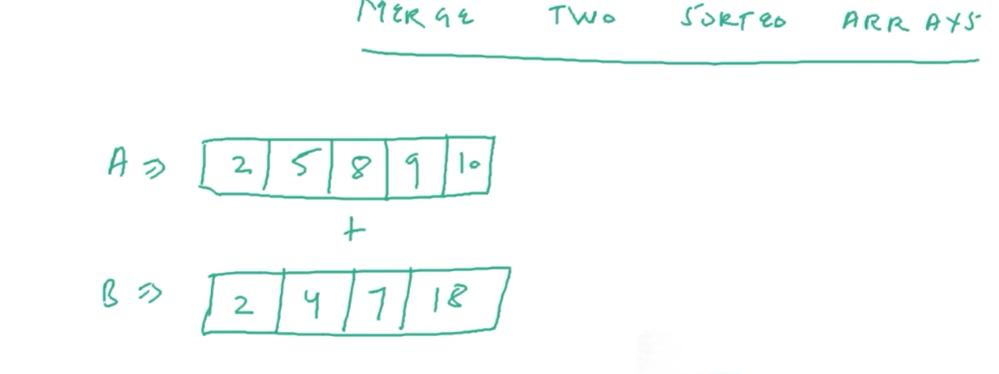
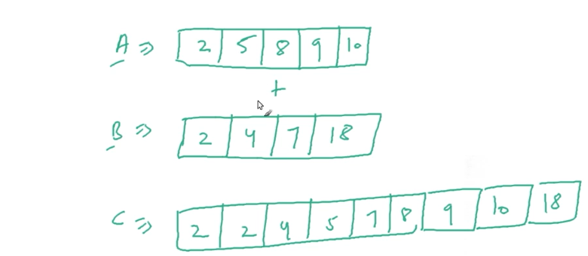

# Sorting
DSA -Sorting in Java Script1.

1.Module introduction  
2.selection sort implementation - java script  
3.Merge two sorted arrays-theory  
4.Merge sort theoty  
5.Merge sort - implementation  
6.Merge sort complexity analysis  
7.Two way partitioning Algorithm  
8.Quick sort - Theory  
7.Quick sort - Implementation  
8.counting sort Algorithm  
9.How to make counting sort stable  
10.Bubble sort - working  
11.Bubble sort implementation - javascript  
12.selection sort - working  
13.Merge two sorted arrays implementation - javascript  
14.Two way partitioning Implementation  
15.counting sort - Implementation  
16.Radix Sort Imtroduction  

# 3.Merge two sorted arrays - theory

 Now A, B are two different Arrays with different data types 

 Let take two sorting arrays with A and B to merge them  

# Merge A & B 

<ul>
<li>
 New Array variable called C to combain two arrays A & B in Assending order
</li>

